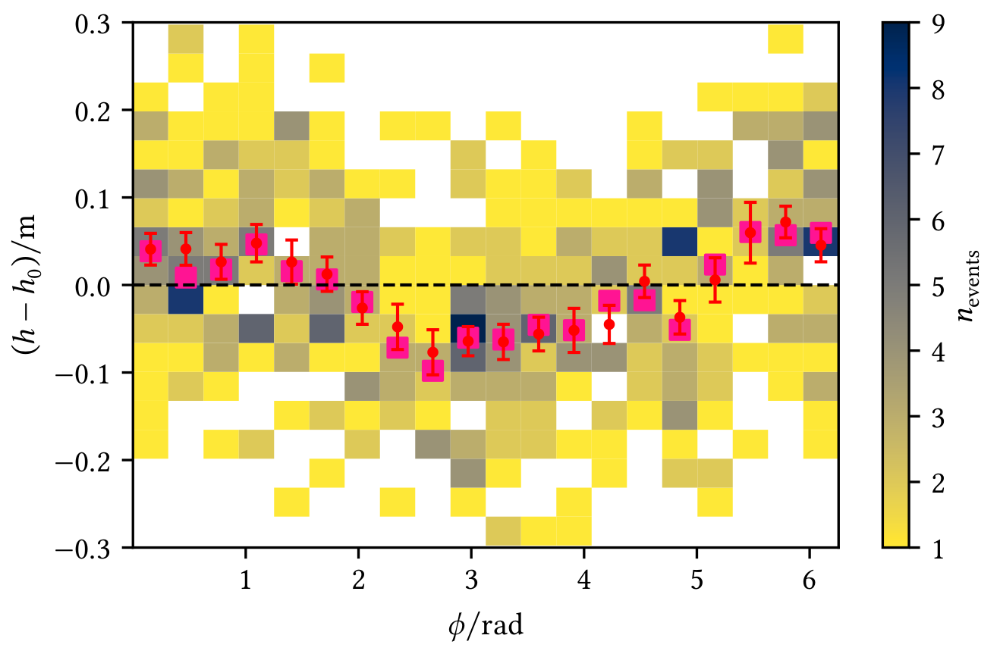
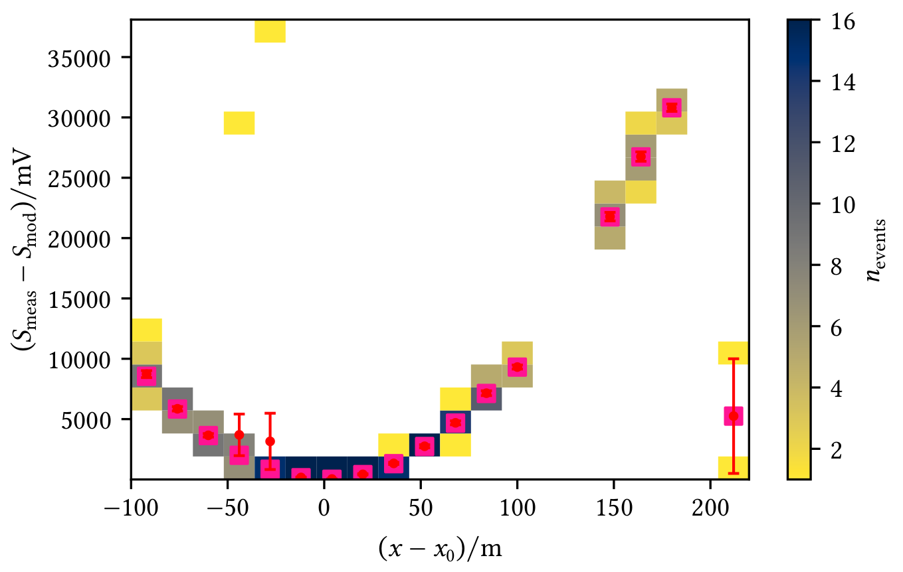
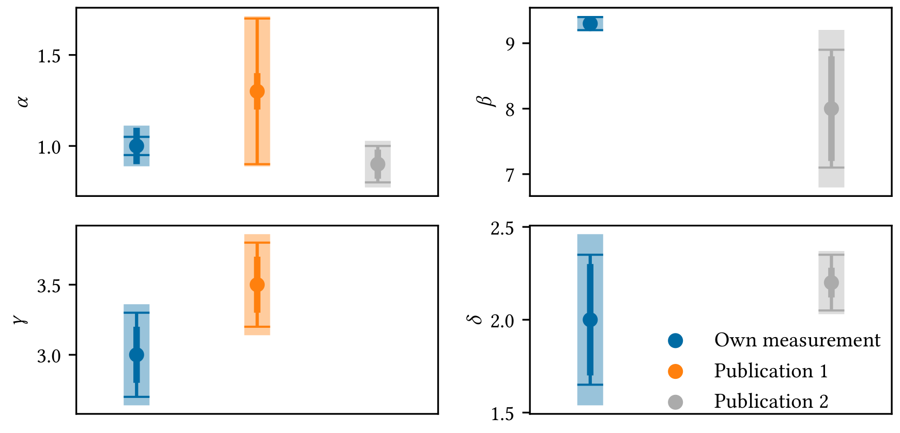

# VisData

**Useful tools for data visualisation, e.g. 2D-profiles, comparison of measurements, or tables.**

***This package is still under development. The features work, but the API might change in the future.***

Developed and maintained by [Philipp Meder](https://github.com/philippmeder).

* **Source code:** https://github.com/philippmeder/visdata
* **Report bugs:** https://github.com/philippmeder/visdata/issues

## License

Distributed under the [BSD 3-Clause License](./LICENSE).

## Features

This README covers the following:
1. [Profile2d Plot for 2D-histograms](#profile2d-plot-for-2d-histograms)
2. [Visual Comparison of Measurements](#visual-comparison-of-measurements-including-uncertainties)
3. [Table Output for Terminal, CSV, and LaTeX](#formatted-table-output-for-terminal-csv-and)
4. [Additional Features](#additional-features)

Check out the [examples](./examples)!

### Profile2d Plot for 2D-histograms
Profiles allow a visual interpretation of the data, e.g. in the following figures where red markers represent the mean with the standard error on the mean and pink markers represent the median of the y-data in each x-bin:

Profile shows an angle-dependent deviation from the zero line | Profile shows deviations from the model
----|----
 | 

Create a Profile2d object with your data and directly add the profile to a plot (you may adjust what and how to plot) or get the profile data and do the plotting yourself.

```python
from matplotlib import pyplot as plt
from visdata import Profile2d

# Example data
x, y = ...

# Create normal 2D-histogram
fig, ax = plt.subplots()
hist, xedges, yedges, image = ax.hist2d(x, y, bins=10)

# Create profile and add it to the axis (using default config)
profile = Profile2d(x, y, bins=10)
profile.add_to_axis(ax)
```

### Visual Comparison of Measurements Including Uncertainties

Sometimes it is easier to understand if different measurements are compatible with each other by looking at a visualisation, e.g. you want to compare your own measurements of some parameters with the measurements presented in other publications with respect to the uncertainties.
The example shows
- *statistical uncertainties* as medium thick errorbars,
- *systematic uncertainties* as thin errorbars with caps,
- *quadratic combination* of both as thick errobars with transparency (for visual guidance only, this value is meaningless).

You can  of course configure what and how to plot.
In this example, *Publication 1* did not provide any values for $\beta$ and $\delta$ while *Publication 2* did not provide a value for $\gamma$.



```python
from visdata import (
    Measurement, MeasurementResult, CompareMeasurementsPlot
)

# Example measurements for multiple parameters
measurement_1 = Measurement(
    "Measurement name",
    {
        "par 1 name": MeasurementResult(
            1, statistical=0.1, systematic=0.05
        ),
        ...
    }
)
measurement_2 = ...

# Create plot object and do the plotting
comp_plot = CompareMeasurementsPlot(measurment_1, measurement_2)
fig, axs, handles, labels = comp_plot.plot()

# At this point you can configure fig and axs the usual way or include a legend with handles and labels
...
```

### Formatted Table Output for Terminal, CSV, and LaTeX

Create a Table object from a 2D-array and get the wanted output, either as a nice terminal output, a CSV table, or a LaTeX table ready for your document.
You can name the columns and rows independently and add a caption if you want. Furthermore, you can specify a formatter for the data.

```python
from visdata import Table

# Setup data and example formatter
data, description, column_labels, row_labels = ...
formatter = "5.2f"

# Create table object
table = Table(
    data,
    description=description,
    column_labels=column_labels,
    row_labels=row_labels
)
# Print the terminal representation as well as CSV and LaTeX
print(table)
print(table.csv(formatter=formatter))
print(table.latex(formatter=formatter))
```

The LaTeX output returns a scientific table.
The terminal representation mimics this, e.g.

```console
            Table: Some important values
────────────────────────────────────────────────────
              a0            a1            a2
────────────────────────────────────────────────────
A0              0.00e+00      1.00e+00      2.00e+00
A1              3.00e+00      4.00e+00      5.00e+00
────────────────────────────────────────────────────
```

### Additional Features
- Decorators for code development, e.g. timer for function execution
- Intervals
- Functions like secans or cos called with angle in degrees
- Regular polygons for plotting and calculation of their most important properties
- Some utilities for matplotlib output

## Installation and Requirements

You will need ``numpy`` and ``matplotlib`` in addition to  ``python 3.13`` (other python version might work but were not tested). You can get the newest version using ``pip`` from the [github repository](https://github.com/philippmeder/visdata):

```
pip install git+https://github.com/philippmeder/visdata
```

An official PyPI release should be available in the near future.